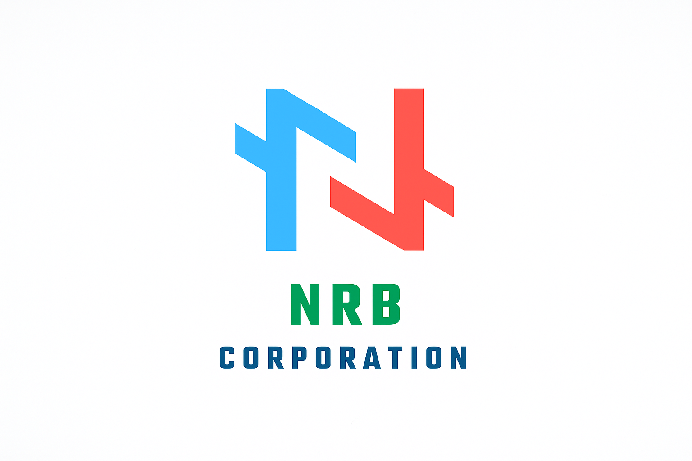

<!-- NRB Corporation - Organization Profile -->

  

<h1 align="center" style="font-family:Poppins; color:#0A2647;">
  <b>NRB Corporation</b>
</h1>

  นวัตกรรมด้านเทคโนโลยีที่เชื่อมโยงผู้คนและองค์กรด้วยความเชื่อมั่นและความเป็นมืออาชีพ  
   Modern • Reliable • Beyond Technology

---

### 💼 About Us
NRB Corporation เป็นบริษัทเทคโนโลยีที่มุ่งเน้นพัฒนา **โซลูชันทางด้าน Cloud, Web, และระบบองค์กร (Enterprise System)**  
โดยทีมงานที่เชี่ยวชาญในด้าน **DevOps, Infrastructure, และ Software Engineering**

- 🧠 เน้นคุณภาพและมาตรฐานระดับสากล  
- 🌐 ให้บริการครอบคลุมทั้งในประเทศและต่างประเทศ  
- ⚙️ ใช้เทคโนโลยีสมัยใหม่ เช่น Next.js, Docker, Kubernetes, Node.js  

---

### 🛠️ Services
| หมวดหมู่ | รายละเอียด |
|-----------|-------------|
| 🌩️ Cloud & Infrastructure | ออกแบบระบบ Cloud, Server, และ CI/CD Pipeline |
| 💻 Web Development | พัฒนาเว็บไซต์และระบบภายในองค์กร |
| 🔐 Security & Compliance | วางระบบความปลอดภัยและมาตรฐานข้อมูล |
| 🤝 Consulting | ให้คำปรึกษาด้านเทคโนโลยีและการวางกลยุทธ์ดิจิทัล |

---

### 👥 Our Team
> ทีมงานมืออาชีพที่มุ่งมั่นพัฒนาเทคโนโลยีให้ยั่งยืน  
> ด้วยความเชื่อว่า “Technology should make life simpler.”

---

### 🌈 Follow Us
[🌐 Website](https://nrb-corporation.pages.dev) | [📫 Contact](mailto:nrbc.corporation@gmail.com) | [💼 LinkedIn](https://linkedin.com/company/nrb-corporation)

---

  

